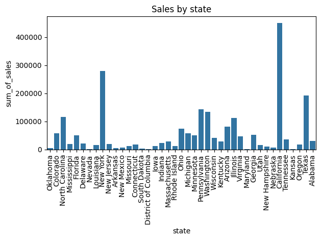
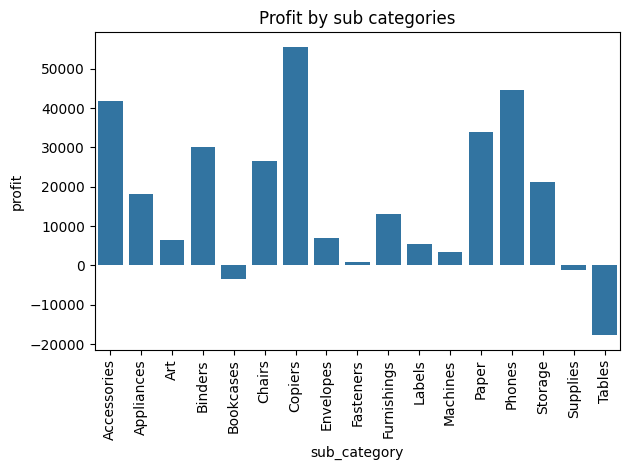
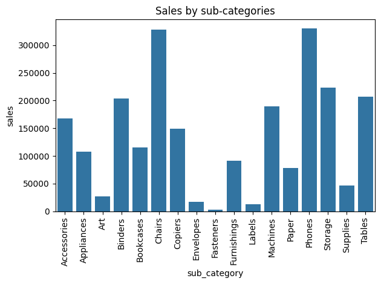
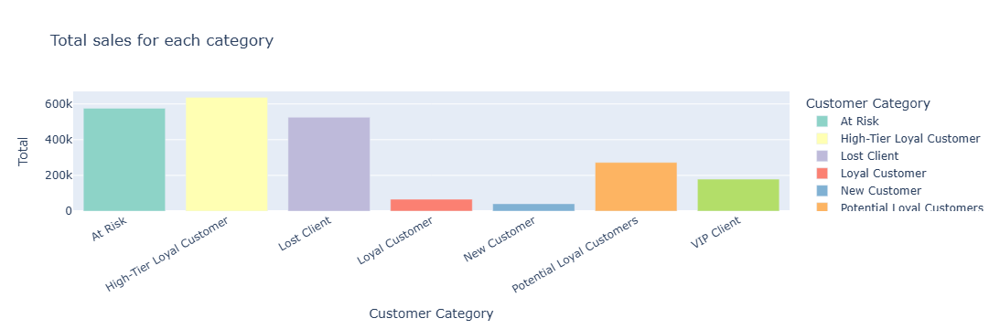

# 📊 Superstore Sales Analysis


*Comprehensive data analysis of the Superstore sales dataset to drive actionable business insights.*

</div>

---

## 🧠 Project Overview

**Superstore Sales Analysis** is a full exploratory and inferential data analysis project that examines retail sales performance across regions, product categories, and customer segments. It transforms raw sales data into actionable insights that can guide strategic business decisions, such as maximizing profits and targeting high-value customers.

This repository includes data processing, visualizations, summary statistics, and key business insights, making it ideal for hiring managers and data science reviewers.

---

## 📈 Business problem

🎯 **Business wants to understand:**

- 🏷️ Sales of which a category/sub-category of items are most profitable and should be prioritized, sales of which category/sub-category of items are unprofitable
- 📍 Regional performance by state and profit distribution, where they have to reduce expenditures for logistics, where marketing and PR department have to work more efficiently
- 🛍️ Which customer segment broughts up the highest amount of money, which customer segment's keeping & attracting process have to be prioritized
- 📊 Correlation between discounts and profitability, how discounts affect overall profitability  
(Visualizations included in 'images/' folder)

---

## 🛠️ Tech Stack

- **Python** — Core language  
- **pandas & numpy** — Data cleaning & manipulation  
- **matplotlib, seaborn, plotly** — Visualizations  
- **Jupyter Notebook** — Interactive analysis  
- **PostgreSQL** — Main Database
- **sqlalchemy, psycopg2** - Database connection & Structured queries

---

## 📂 Project Structure

```SUPERSTORE_SALES_ANALYSIS
├── data/                  # Superstore dataset 
├── images/                # Visualizations
|    ├── images_from_EDA.docx
|    ├── images_from_RFM_analysis.pdf              
├── src/                   # Source code
|    ├──config.py (hidden)
|    ├──EDA.py
|    ├──ETL_pipeline.py
|    ├──functions.py
|    ├──RFM_analysis.ipynb
|    ├──sql_queries.py                
├── README.md       # Project Documentation
└── requirements.txt              # Dependencies

```

---

## 🚀 Quick Start

### **1. Clone the repository**

```bash
git clone https://github.com/Fridrichfede/Superstore-sales-analysis.git
cd Superstore-sales-analysis
````

### **2. Install dependencies**

```bash
pip install -r requirements.txt
```

### **3. Open the analysis notebook**

```bash
jupyter notebook
```

---

## 📊 Example Results and Business Insights

### **Sales Trend by State and Suggestions for Increase in Sales**

```markdown

```

As can be seen from the bar plot, sales are at a catastrophically low level in several states at once (Oklahoma, Nevada, South Dakota, the District of Columbia, Maryland, Kansas, and Arkansas). Taking into account both the low sales figures and the population sizes of these states, it would be most profitable for the business to improve the efficiency of marketing and targeting in states such as Oklahoma, Nevada, Maryland, Kansas, and Arkansas.

In states such as South Dakota and the District of Columbia, however, it would be more reasonable to reduce logistics costs, since low sales in these cases are not caused by ineffective marketing or other controllable factors, but by the very small size of the markets, which are fundamentally unable to generate high revenue.

Additionally, the business should work on improving advertising effectiveness and marketing strategies in highly populated states such as Florida, Ohio, Georgia, and Michigan, because although sales performance in these states is better than in the previously mentioned ones, it is still relatively low given the scale of these markets.

 ---

### **Which product subcategories generate the highest profit and sell well, and which ones are unprofitable**

```markdown


```

Based on the information provided by the bar plot, the business needs to increase prices for products in the *Tables*, *Binders*, and *Machines* subcategories, because despite strong sales volumes, these products have unprofitable margins. A higher price will likely cool demand for products in these subcategories, but it will help prevent even greater losses.

Sales of products in the *Bookcases* and *Appliances* subcategories should be phased out, as even taking into account their negative profitability, they do not sell at an adequate level.

It is also recommended to improve marketing efficiency or slightly reduce prices for products in the *Fasteners*, *Envelopes*, *Labels*, and *Art* subcategories. This will reduce their profitability but help improve the catastrophically low level of sales in these subcategories.

 ---

### **Which customer segment should the business prioritize most for acquisition and retention?**

```markdown


```

From the bar plot above, it is clear that the largest inflow of revenue for the business is generated not by VIP customers, but by high-tier loyal customers and customers who are at risk of churn. Based on these findings, the business is advised to run targeted advertising campaigns and targeted promotions for customers who are at risk of leaving, as well as to ensure the loyalty of high-tier loyal customers and VIP customers (since the median customer in this segment spends the most, which means that the most valuable customers belong to this category) through similarly targeted promotions.

---

## 📘 Methodology

1. **Data Cleaning & Preparation:**
   • Handle missing values, correct formats, engineer useful features
2. **Exploratory Data Analysis:**
   • Summary stats, segment breakdowns, trend analysis
3. **Visualization & Interpretation:**
   • Clear charts for each key business question
4. **Business Recommendations:**
   • Tactical suggestions based on insights

---

## ✨ Future Work

Here are suggestions to expand this project:

1. 🚀 Build an interactive dashboard (e.g., with Streamlit)
2. 📊 Add predictive modeling (e.g., sales forecasting)
3. 📌 Deploy results with a web-based report

---

## 🤝 Contributing

Contributions, suggestions, and improvements are *welcome*!
To contribute:

1. Fork the repo
2. Create a new feature branch
3. Submit a Pull Request

---

## 📬 Contact

### **Zhassuzak Mussa**

🔗 LinkedIn: [https://www.linkedin.com/in/zhassuzak-mussa-27898633b/](https://www.linkedin.com/in/zhassuzak-mussa-27898633b/)

📧 Email: [zhasuzakmusa@gmail.com](mailto:zhasuzakmusa@gmail.com)

---
